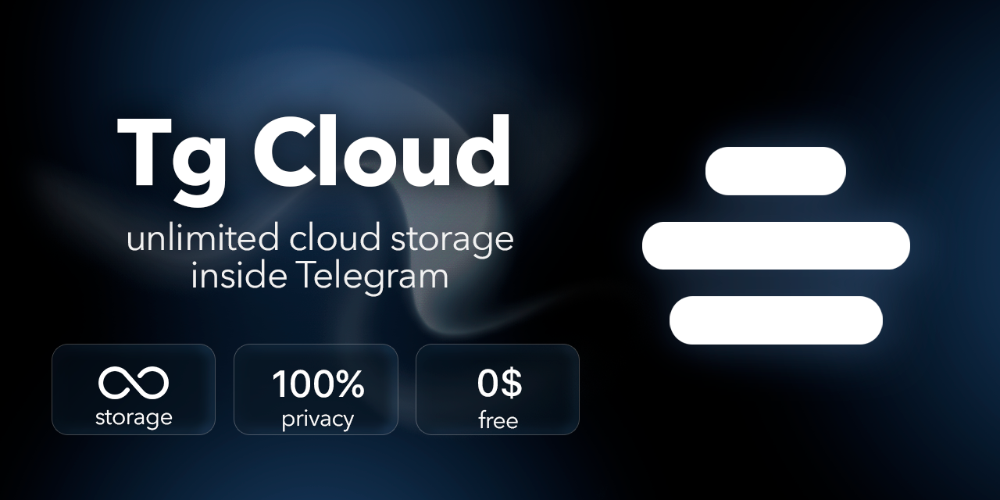
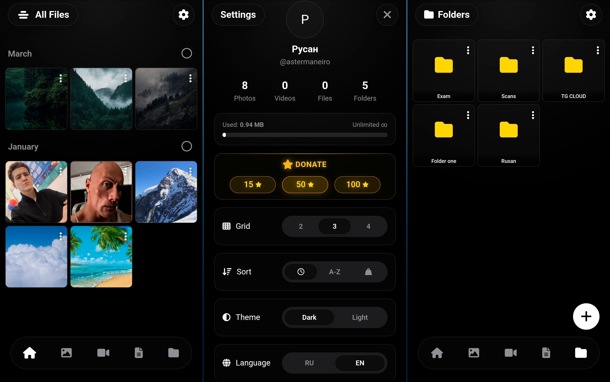

# ☁️ Tg Cloud — Your Unlimited Cloud Storage in Telegram

👉 **[Launch the App in Telegram](https://t.me/RusanCloudBot)**

**Tg Cloud** is an innovative cloud storage solution built as a Telegram Mini App (TMA). This project solves the messenger's main problem: it turns the chaotic "Saved Messages" feed into a fully-fledged, structured, and user-friendly file system. 

Store gigabytes of photos, videos, and documents absolutely free of charge, without taking up your phone's memory!

---

## 🌟 Key Features & Capabilities

*   📁 **True File System:** Create folders of any depth, move files, and sort them by date, name, or size.
*   ♾️ **Unlimited Space:** Files are physically stored on Telegram's reliable servers. We have no tier limits, volume restrictions, or paid subscriptions for gigabytes.
*   ⚡ **Lightning Speed:** Thanks to advanced client-side RAM caching, switching between tabs and folders happens instantly, with no annoying loading screens.
*   🔗 **Advanced Sharing:** Share files and entire folders in one click. The recipient can follow the link and copy the entire folder structure (with all nested files) to their own cloud in a single click.
*   🖼️ **Media Previews:** Photos and videos are displayed as beautiful thumbnails right in the file grid, rather than generic icons.
*   🎨 **Modern Design:** A frosted-glass interface that adapts to you:
    *   Light and Dark themes.
    *   Adjustable grid size.
    *   Support for English and Russian languages.

---

## 🛠 How It Works (Service Architecture)

Typically, cloud storage requires massive hard drive expenses (AWS S3, Google Cloud). **Tg Cloud** uses a hybrid approach:

1.  **Heavy files** (binary data) are sent by the user to the bot, and they permanently settle in Telegram's infinite storage.
2.  Telegram returns a unique file key — `file_id`.
3.  **Our server** takes this `file_id`, the file name, its size, and writes them into a fast relational database, linking them to the user's folders.
4.  **The Frontend** (Mini App) requests this structure and visualizes it as a familiar iOS/Android file manager interface.

To bypass browser security restrictions (CORS) when rendering images, our backend uses its own proxy-streaming that transfers image bytes directly to the client.

---

## 💻 Technology Stack

Despite its visual lightness (SPA), a powerful asynchronous architecture works under the hood:

*   **Frontend (Client):** Vanilla JavaScript (ES6+), HTML5, CSS3. 
    *   *Dropping heavy frameworks (React/Vue) allowed us to make the app ultra-lightweight and fast on any smartphone.*
    *   Uses the Telegram Web Apps SDK.
*   **Backend (Server):** Python 3.10+
    *   **FastAPI:** For a high-performance REST API.
    *   **Aiogram 3.x:** For asynchronous Telegram bot operations, generating invoices, and Deep Linking.
*   **Database:** PostgreSQL (via the Supabase platform).
    *   Uses the *Adjacency List* pattern to implement infinite folder nesting.

---

## ⭐ Project Support

The app integrates native monetization via **Telegram Stars**. Users can support the development with a single click directly from the cloud settings, without entering bank card details.

---

**Author and Developer:** Rusan Galiev  
*Built with a passion for optimization and clean code.*